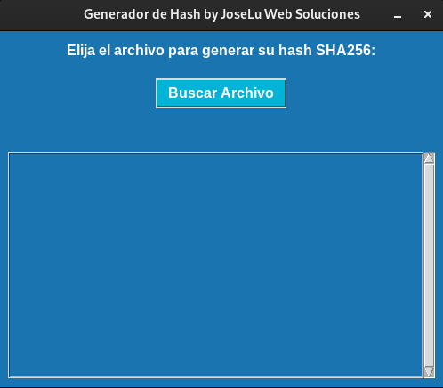

# Generador de HASH SHA256

## Capturas de Pantalla

* Objetivo
* Herramientas
* Instalación
* Conclusión

---
## Objetivo
El objetivo de este respositorio es subir mis prácticas, en este caso utilizando cómo lenguaje de programación **Python**.
Después de investigar e ir comparando código, fuí desarrollando de a poco esta app. La misma es con fines educativos, no soy responsable por el uso que se le de a la misma.
En este caso es un generador de hash SHA256, me paso en el trabajo que un cliente nos pidió una copia de la base de datos para una auditoría y que necesitaban el hash de la misma, así que ante esta necesidad vi la posibilidad de hacer algo en **Python** y no por terminal cómo lo venía haciendo siempre en casa. Investigué un poco, y ya que estaba fuí consultando con don GPT para mejorar el código dando cómo resultado este generador que les comparto.

## Herramientas
* tkinter
* hashlib

## Para ejecutarlo, en una termial escribir:
~~~
$ python3 index.py
~~~

## Conclusión
